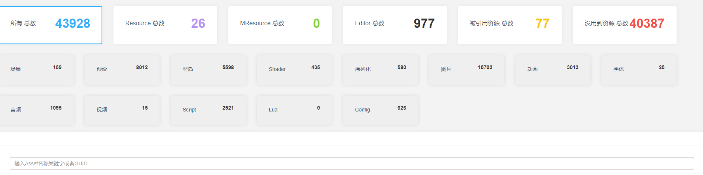
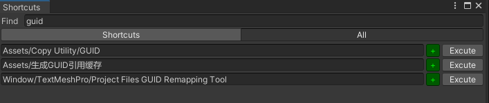
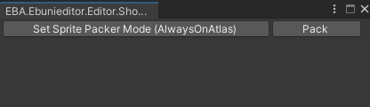
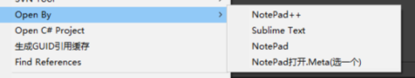
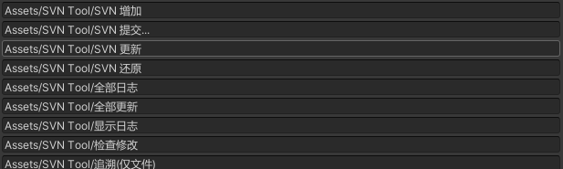
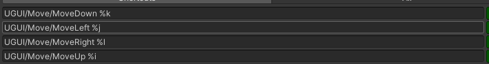
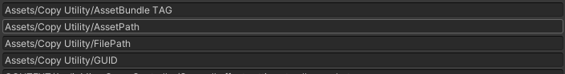
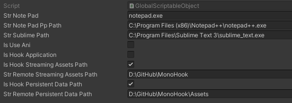

# EBUniEditor

**EBUniEditor**是一个Unity下的编辑器开发缝合包，主要缝合了一些常用的编辑器功能，主要做一个备份之前换电脑发现好多东西都丢了。

## 	

## 目录结构

```lua
├─Documentation
│  └─images
├─Editor
│  ├─Common
│  ├─EditorHook
│  │  └─Hook
│  │      └─Scripts
│  │          ├─Others
│  │          └─UnityHook
│  │              ├─Plugins
│  │              └─TestCase
│  │                  ├─Editor
│  │                  └─SceneViewCamera
│  │                      └─Editor
│  ├─EmmyLua
│  ├─FindReferencesInProject2
│  ├─GUIDRef
│  │  └─web
│  ├─LuaProfiler
│  │  ├─Common
│  │  │  ├─Setting
│  │  │  └─Struct
│  │  ├─Core
│  │  │  ├─Driver
│  │  │  │  └─Parse
│  │  │  └─NetWork
│  │  ├─Editor
│  │  │  ├─CECIL
│  │  │  └─Window
│  │  │      ├─Client
│  │  │      └─ProfilerWin
│  │  │          ├─NetWork
│  │  │          ├─Setting
│  │  │          └─TreeView
│  │  └─Plugins
│  ├─Shortcut
│  ├─Subversion
│  ├─UGUI
│  └─UGUI-Editor
│      ├─Common
│      ├─Editor
│      └─Res
│          └─Preview
├─Runtime
├─Samples
│  └─Example
└─Tests
    ├─Editor
    └─Runtime
```

## 包含的功能

### EditorHook

EditorHook主要是用来Hook一些Unity的函数相关的，比如我需要把streamingAssetsPath换个目录，只需要勾选**Assets/SO/GlobalScriptableObject.asset**下的**isHookStreamingAssetsPath**和**isHookApplication**，这个一般用作我们打包完后需要用到其他的目录下的AssetBundle文件，这只需要换个目录就能实现，具体实现也很简单，参考[MonoHook](https://github.com/Misaka-Mikoto-Tech/MonoHook)食用最佳。

```c#
public static void OnStartGame()
        {
            EditorApplication.playModeStateChanged += OnPlayerModeStateChanged;
            if (!GlobalScriptableObject.Instance.isHookApplication)
                return;

            List<HookInfo> hookInfos = new List<HookInfo>()
            {
                new HookInfo()
                {
                    OldMethod = "get_streamingAssetsPath",
                    NewMethod = "get_streamingAssetsPath",
                    ProxyMethod = "GetStreamingAssetsPathProxy",
                    SrcType = typeof(Application),
                    DestType = typeof(ApplicationHook),
                },
                new HookInfo()
                {
                    OldMethod = "get_persistentDataPath",
                    NewMethod = "get_persistentDataPath",
                    ProxyMethod = "GetPersistentDataPathProxy",
                    SrcType = typeof(Application),
                    DestType = typeof(ApplicationHook),
                },
            };
            
            foreach (var hookInfo in hookInfos)
            {
                var target = hookInfo.SrcType.GetMethod(hookInfo.OldMethod, bindingFlags);
                var dest = hookInfo.DestType.GetMethod(hookInfo.NewMethod, bindingFlags);
                var proxy = hookInfo.DestType.GetMethod(hookInfo.ProxyMethod, bindingFlags);
                var hook = new MethodHook(target, dest, proxy);
                hook.Install();
                MethodHooks.Add(hook);
            } 
            Debug.Log("Application.persistentDataPath:" + Application.persistentDataPath);
            Debug.Log("Application.streamingAssetsPath:" + Application.streamingAssetsPath);
        }
```

### EmmyLua

这个是一个用于EmmyLua全提示的插件，最适合Lua崽了，相关目录下有需要相同配置的文件

1. 手动安装最新版本EmmyLua插件，以及EmmyLua-Unity插件
2. 打开Unity，点击菜单 Lua->EmmyLua -> Enable 来启用API服务
3. 打开IDEA 即可在Lua代码中使用C#端的API提示

### FindReferencesInProject2

这是收录的 [FindReferencesInProject2](https://github.com/networm/FindReferencesInProject2)，食用按原来的文档，我这里扩展了几个接口

### GUIDRef

这个是对整个项目的一个文件夹使用的分析 **Assets/生成GUID引用缓存**，截图如下



### LuaProfiler

Lua崽必备，食用指南 [LuaProfiler](https://github.com/leinlin/Miku-LuaProfiler)

### Shortcut

这个是集成了一些类似快捷键的功能

#### Window/ShortcutWindow 快捷使用MenuItem特效的窗口（高版本可直接使用QuickSearch）



#### Window/SpritePackerShortcutWindow 图集预览窗口



通过其他第三方软件打开我们的Asset



### Subversion

这是一个集成了Svn的一个操作，方便我们在项目中直接通过Svn来更新或者其他操作，这个也容易扩展其他的操作，需要参考Svn的帮助相关执行对应的命令就行了。



### UGUI

拼图崽必备，主要是在自定义创建UI组件，方便后期优化，加了一个类似PS的微调功能



### UGUI-Editor

食用指南 [UGUI-Editor](https://github.com/liuhaopen/UGUI-Editor.git)

### 其他





## 可UPM安装的第三方

- **[PlayerPrefsEditor](https://github.com/sabresaurus/PlayerPrefsEditor)**一个管理Unity持久化数据的插件
- git+https://gitlab.hotreload.net/root/hot-reload-releases.git#1.9.4 Unity的hotReload方案

